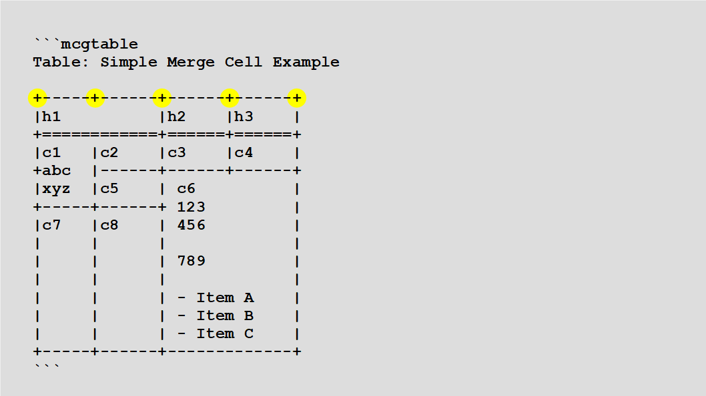
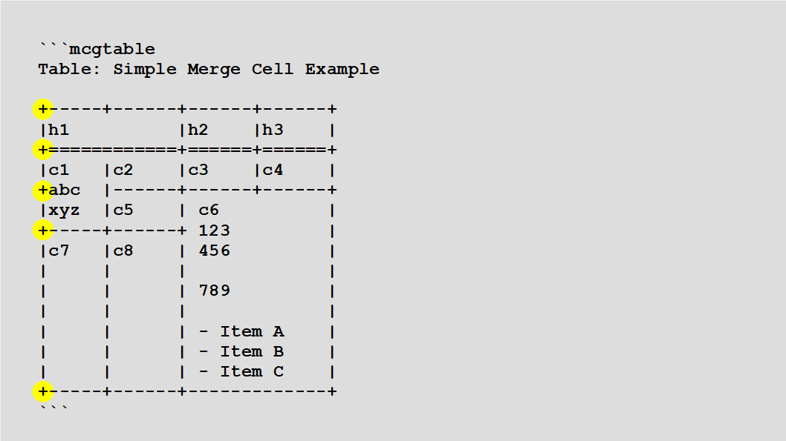
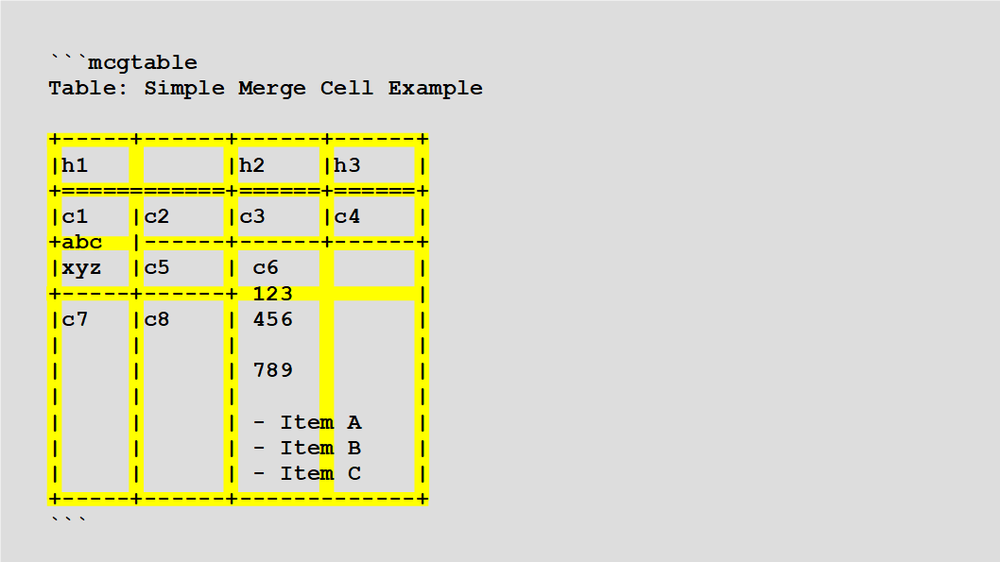
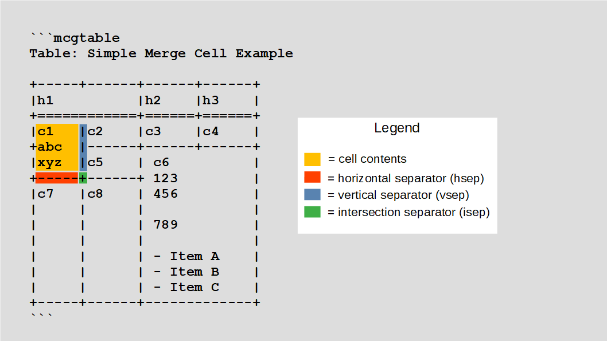

<!--
SPDX-FileCopyrightText: 2021 Michael Webster
SPDX-FileCopyrightText: 2021 Western Digital Corporation or its affiliates

SPDX-License-Identifier: GPL-3.0-or-later
-->

---
title: Merge Cell Grid Table User Manual
author: Michael Webster
---


Introduction
============

The Merge Cell Grid Table is a utility to convert a Markdown-like syntax of a
table into a tagged description of the same table.  The primary feature this
utility provides beyond existing Markdown pipe tables is the ability to merge
adjacent cells into larger multi-column or multi-row merged cells.  This ability
to describe merged cells is particularly useful in Markdown documentation
describing bit and byte fields for software or hardware designs.  The author of
this utility created it for this intended purpose although merged cells are
useful for any type of tabular data that needs cells to span columns or rows.

The utility operates in one of two modes:

1. As a [Pandoc Lua Filter](https://pandoc.org/lua-filters.html)
2. In command line mode

The command line mode is intended for testing purposes within this package's
test suite although it is conceivable it might be used for converting the syntax
into tagged content for document utilities other than Pandoc.

The utility converts the syntax into one of the following tag formats:

1. HTML tables
2. DocBook tables (i.e. CALS tables)

There is nothing intrinsically limiting this utility's ability to output other
tag formats (e.g. LaTeX tables) other than the author's ignorance of those other
tag formats.  Contributors are welcome to add other output tag formats to the
utility.


Feature List
------------

Below are the currently supported features of the utility:

- Merged cells that may span across column and/or row boundaries
- Table header, table body, and table footer
- Table caption
- Visible and invisible column and row boundaries
- Generates either HTML or DocBook tags to be re-ingested by Pandoc which Pandoc
  then passes through to the output

Below is a list of planned, future features of the utility:

- Single-line table row mode (and switching between multi-line mode and
  single-line mode)
- Grabbing attributes and control parameters from either the table caption or
  the surrounding code block to allow users to change this utility's behavior
  and output on a per-table basis within their document
- Generating additional output attributes to aid users in styling their tables.
  For example, adding attributes to row tags as either "even" or "odd" to allow
  coloring alternating rows.


An Example
==========

Below is an example showing the Markdown-like syntax in a code block to Pandoc.

~~~~~~
```mcgtable
Table: Simple Merge Cell Example

+-----+------+------+------+
|h1          |h2    |h3    |
+============+======+======+
|c1   |c2    |c3    |c4    |
+abc  |------+------+------+
|xyz  |c5    | c6          |
+-----+------+ 123         |
|c7   |c8    | 456         |
|     |      |             |
|     |      | 789         |
|     |      |             |
|     |      | - Item A    |
|     |      | - Item B    |
|     |      | - Item C    |
+-----+------+-------------+
```
~~~~~~

Which this utility converts into tagged output which is rendered like the
following table.

```mcgtable
Table: Simple Merge Cell Example

+-----+------+------+------+
|h1          |h2    |h3    |
+============+======+======+
|c1   |c2    |c3    |c4    |
+abc  |------+------+------+
|xyz  |c5    | c6          |
+-----+------+ 123         |
|c7   |c8    | 456         |
|     |      |             |
|     |      | 789         |
|     |      |             |
|     |      | - Item A    |
|     |      | - Item B    |
|     |      | - Item C    |
+-----+------+-------------+
```


The Syntax
==========

The following sections describe the Markdown-like syntax for Merge Cell Grid
Tables.  Since this utility is used as a Pandoc filter, the table must be
enclosed inside a code block with the "mcgtable" class so that the filter can
detect these source lines as representing a Merge Cell Grid Table in need of
being converted to a tagged format of the table.

The utility supports a table caption declared either before or after the table
contents. Such a table caption is on a single line and prefixed with the text
"Table:".  Table captions are optional.


Initial Row Separator
---------------------

All columns must be declared in the initial row separator.  In the following
figure each column is being declared by the Plus sign characters highlighted
with yellow circles.

{ width=100% }

Note that even though cell "h1" doesn't use the column declared by the second
Plus sign in the initial row separator, that Plus sign is still required in
order to declare that column for subsequent rows and cells.  In fact cell "h1"
is our first example of a cell spanning columns.


Initial Column Separator
------------------------

When in multi-line mode, all rows must be declared in the initial column
separator.  In the following figure each row is being declared by the Plus sign
characters highlighted with yellow circles.

{ width=100% }

Note that even though the cell "c1" doesn't use the row declared at the third
Plus sign in the initial column separator, that Plus sign is still required in
order to declare that row for subsequent cells. Cell "c1" is our first example
of a cell spanning rows.

The yet-to-be-implemented single-line mode will have slightly different rules,
but a Plus sign in the initial column separator will still define a new row
while in single-line mode.  Such a Plus sign will also switch from single-line
mode back to multi-line mode.


Cell Boundaries
---------------

The columns and rows declared in the initial row separator and initial column
separator define all the locations in the table that potentially contain
separator characters.  The figure below shows all those character locations
highlighted in yellow.  These locations are called "boundaries".

{ width=100% }

There are three types of boundaries:

- Column boundaries which separate columns
- Row boundaries which separate rows
- Intersection boundaries which are simultaneously both column and row
  boundaries

The following characters have special meaning when detected at column, row,
or intersection boundary positions:

- Plus (i.e. '+') is an intersection char and also sets multi-line mode
- Hash (i.e. '#') is an intersection char and also sets single-line mode
- Vertical bar (i.e. '|') is a column boundary
- Dash (i.e. '-') is a row boundary
- Equals (i.e. '=') is a row boundary and marks the end of the table header
- Underscore (i.e. '_') is a row boundary and marks the start of the table
  footer
- Colon (i.e. ' : ') is a row boundary and is also used to set cell alignment
  (i.e. left justified, center justified, or right justified)
- Space (i.e. only ASCII 0x20 - not Tab!) is an invisible column or row
  boundary depending on where it is found.  Space is not considered special when
  detected at an intersection boundary.

Please note, Tab chars are not allowed.  The utility will fail with an error
message if it detects a Tab anywhere within the table.  It is strongly
recommended you turn on your text editor's feature to convert Tabs into Spaces.

Unlike Markdown pipe tables the Vertical bar chars must appear at the declared
column boundaries.  Vertical bar chars found at other locations are treated like
normal chars as are all the above chars when found outside their defined
boundary positions.  When using a Merge Cell Grid Table you must be precise in
your use of separator chars.  You may not be sloppy like you can be with pipe
tables (just one of the prices you must pay in order to use Merge Cell Grid
Tables).

The limits of each cell are defined by boundaries which only contain valid
separator chars.  A single invalid separator char is enough to cause the utility
to consider the cell spanning across that boundary.  The following figure
highlights how the limits of the cell "c1" are determined.

{ width=100% }

There are three types of separators:

- A horizontal separator (hsep) which is highlighted in red
- A vertical separator (vsep) which is highlighted in blue
- An intersection separator (isep) which is highlighted in green

The rest of the chars for cell "c1" are considered cell contents which are
highlighted in orange in the figure.

Please note that the cell limits are defined by the following:

- The hsep at the bottom of the cell
- The vsep to the right of the cell
- The isep to the lower-right of the cell

The hsep above the cell, the vsep to the left of the cell, and the other iseps
play no role in defining the limits of the cell.  However, all the separators
surrounding a cell do play a role in defining whether a cell border is visible
or hidden.

In this example the "c1" cell is considered as spanning a row since the line
containing the text "abc" constitutes invalid separators chars for that
boundary.  Also the Vertical bar on that line marks that intersection boundary
as counting only as a vsep and not as an isep.  Since this boundary doesn't
mark the limit of the cell the next boundary is checked.  That boundary does
contain only valid separators so it becomes the hsep and isep.  This isn't the
complete story.  There are a few more details, but this gives you the basic
gist of how to declare a merged cell that spans a boundary and that basic rule
is: fill the intended boundaries of the merged cell with valid separator chars
and leave at least one invalid separator char at all boundaries across which
you wish to span.


Some Finer Details
------------------

To recap the special chars:

1. Plus and Hash are intersection boundary chars and count as both a vertical
   separator and a horizontal separator
2. Vertical bar and Space are column boundary chars and count as vertical
   separators
3. Dash, Equals, Underscore, Colon, and Space are row boundary chars and count
   as horizontal separators

Stated another way, below are the tests for validity of the separators:

1. If a column boundary contains a Vertical bar or Space then it is considered
   a valid vsep char.  Any other char is considered an invalid vsep char.
2. If a row boundary contains a Dash, Equals, Underscore, Colon, or Space then
   it is considered a valid hsep char.  Any other char is considered an invalid
   hsep char.
3. If an intersection boundary contains a Plus or Hash then it is considered a
   valid isep char.
    1. If an intersection boundary contains a Vertical bar then it is considered
       a valid vsep char instead of an isep char
    2. If an intersection boundary contains a Dash, Equals, Underscore, or
       Colon then it is considered a valid hsep char instead of an isep char
    3. Any other char (including Space) at an intersection boundary means it is
       not a valid vsep, hsep, or isep char

For a column boundary to be considered as the limit of a cell then that column
boundary must contain valid vsep chars and a final valid isep char.  Anything
else means the cell is spanning that column boundary.

For a row boundary to be considered as the limit of a cell then that row
boundary must contain valid hsep chars and a final valid isep char.  Anything
else means the cell is spanning that row boundary.

There are also a few other things that will terminate a row span.

- You may not span a cell from the table header into the next table section
  (i.e. table body or table footer).  Any attempt to do so will cause the cell
  within the header to stop at the end of the table header and a new cell to
  begin in the next table section
- You may not span a cell from the table section before the table footer (i.e.
  the table header or table body) into the table footer.  Any attempt to do so
  will cause the cell before the table footer to stop and a new cell to begin
  inside the table footer.
- Row spanning must result in rectangular merged cells.  If you attempt to row
  span two cells with different column spans then the row span does not happen.
  Note the utility detects column spans as a first step and then detects row
  spans as a second step.


Using with Pandoc
=================

To use the utility with Pandoc you must add a command line parameter telling
Pandoc where to find the filter.  The following is an example command line:

```
pandoc doc.md -o doc.xml -f markdown --lua-filter path/to/mcell-grid-table.lua -t docbook
```

Shrink-it: 75%

The utility automatically detects it is being run as a filter with Pandoc by
checking the `PANDOC_VERSION` environment variable for a non-empty value.


Using on Command Line
=====================

To use the utility on the command line you must pipe your input document into
`stdin` and redirect `stdout` to an output file.  The following is an example
command line:

```
lua path/to/mcell-grid-table.lua -t html < in-doc.txt > out-doc.txt
```

Shrink-it: 75%

This example shows using file names with a ".txt" extension because in command
line mode you are only getting an HTML fragment (or DocBook fragment if you
change to use `-t docbook`) of the table.  If you want to translate a whole
markdown document then use the utility with Pandoc.

For more command line help use:

```
lua path/to/mcell-grid-table.lua --help
```

Shrink-it: 75%


More Examples
=============

The following sections cover a few more example tables.

A Real World Example
--------------------

The following shows a table using merge cells to depict the bit and byte fields
of a SCSI INQUIRY command.

~~~~~~
```mcgtable
Table: SCSI INQUIRY Command

+:----:+:-------:+:-------:+:-------:+:-------:+:-------:+:-------:+:-------:+:-------:+
|      |                                      Bit                                      |
+      |-------------------------------------------------------------------------------+
| Byte |    7    |    6    |    5    |    4    |    3    |    2    |    1    |    0    |
+======+=========+=========+=========+=========+=========+=========+=========+=========+
|   0  |                              Operation Code (12h)                             |
+------+-------------------------------------------------------------------------------+
|   1  |                          Reserved                         | Obsolete|   EVPD  |
+------+-----------------------------------------------------------+---------+---------+
|   2  |                                   Page Code                                   |
+------+-------------------------------------------------------------------------------+
|   3  | (MSB)                                                                         |
+------+:--------+                     Allocation Length                     |---------+
|   4  |                                                                         (LSB) |
+------+---------+-----------------------------------------------------------+--------:+
|   5  |                                    Control                                    |
+------+-------------------------------------------------------------------------------+
```
~~~~~~

Shrink-it: 75%


Which results in this table.


```mcgtable
Table: SCSI INQUIRY Command

+:----:+:-------:+:-------:+:-------:+:-------:+:-------:+:-------:+:-------:+:-------:+
|      |                                      Bit                                      |
+      |-------------------------------------------------------------------------------+
| Byte |    7    |    6    |    5    |    4    |    3    |    2    |    1    |    0    |
+======+=========+=========+=========+=========+=========+=========+=========+=========+
|   0  |                              Operation Code (12h)                             |
+------+-------------------------------------------------------------------------------+
|   1  |                          Reserved                         | Obsolete|   EVPD  |
+------+-----------------------------------------------------------+---------+---------+
|   2  |                                   Page Code                                   |
+------+-------------------------------------------------------------------------------+
|   3  | (MSB)                                                                         |
+------+:--------+                     Allocation Length                     |---------+
|   4  |                                                                         (LSB) |
+------+---------+-----------------------------------------------------------+--------:+
|   5  |                                    Control                                    |
+------+-------------------------------------------------------------------------------+
```

Please note this table demonstrates the following features which we have not
discussed yet:

- Each hsep in the initial row separator has a colon on each side.  This
  signifies center alignment.  When done on the initial row separator the
  alignment value becomes the default for that column.
- The cells with "(MSB)" and "(LSB)" text are marked as left aligned and right
  aligned respectively.  Unlike other table markdown syntax this alignment is
  indicated on the hsep, but takes effect for this cell not the next cell down.
- The Vertical bar to right the "Allocation Length" text is not strictly
  neccessary, but does clearly indicate our intention to row span
- The example also demonstrates the use of invisible or hidden borders.  In this
  example the cells for bit fields on bytes 3 and 4 are using hidden borders.
  A hidden border is indicated by having at least one Space in the associated
  hsep or vsep.


Merge Cells Must be Rectangular
-------------------------------

The following example shows what happens when you attempt to merge cells that
do not result in a rectangle.

~~~~~~
```mcgtable
Table: Merge Cells Must be Retangular

+==========+==========+==========+==========+
| z1       | z2       | z3                  |
+----------+----------+           ----------+
| z4       | z5                  | z6       |
+__________+_____________________+__________+
| Notes:                                    |
|                                           |
| - This table has a footer, but no header  |
| - Merging cells z3 and z5 would not be    |
|   rectangular so while it makes a great   |
|   Tetris piece, it does not create a      |
|   merged cell                             |
+-------------------------------------------+
```
~~~~~~

Instead of getting a merged cell between z3 and z5 you get separate cells with
some hidden borders.  This example renders better in HTML.

```mcgtable
Table: Merge Cells Must be Retangular

+==========+==========+==========+==========+
| z1       | z2       | z3                  |
+----------+----------+           ----------+
| z4       | z5                  | z6       |
+__________+_____________________+__________+
| Notes:                                    |
|                                           |
| - This table has a footer, but no header  |
| - Merging cells z3 and z5 would not be    |
|   rectangular so while it makes a great   |
|   Tetris piece, it does not create a      |
|   merged cell                             |
+-------------------------------------------+
```
